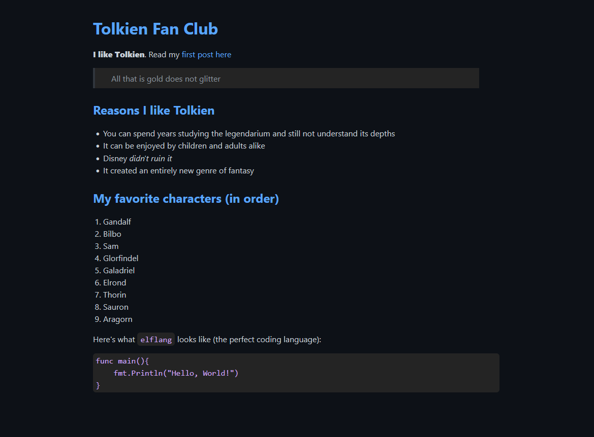

This is a project guided by [boot.dev](boot.dev)

It will convert markdown files into html files and host them locally.

Example:

# Tolkien Fan Club

**I like Tolkien**. Read my [first post here](/majesty)

> All that is gold does not glitter

## Reasons I like Tolkien

* You can spend years studying the legendarium and still not understand its depths
* It can be enjoyed by children and adults alike
* Disney *didn't ruin it*
* It created an entirely new genre of fantasy

## My favorite characters (in order)

1. Gandalf
2. Bilbo
3. Sam
4. Glorfindel
5. Galadriel
6. Elrond
7. Thorin
8. Sauron
9. Aragorn

Here's what `elflang` looks like (the perfect coding language):

```
func main(){
    fmt.Println("Hello, World!")
}
```

This will be converted into:

